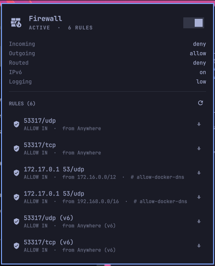

# Firewall

ufw status in the Omarchy bar.

A wall with flames while the firewall is up; the same wall with the fire out,
in the theme's urgent colour, while it is down. Click it for the default
policies, the rules currently in place, and the one switch that changes any
of it.



## What it shows

**In the bar** — one icon, three states:

| State | Icon | Colour |
|-------|------|--------|
| Active | wall with flames | bar foreground |
| Inactive | wall, no flames | bar urgent |
| Not installed, or not yet read | wall, no flames | dimmed |

Active, sitting among its neighbours at the right end of the bar:


Inactive — the flames are out and the wall has gone to the theme's urgent
colour, which is the point: it should be the thing your eye lands on:


Hovering gives the same thing in words: `active — 6 rules`, `inactive —
nothing is being filtered`, `ufw is not installed`.

**In the panel** — the switch, the default policies for incoming, outgoing and
routed traffic, whether IPv6 is on, the log level, and every rule ufw would
print, written the way `ufw status` writes it so the two can be checked against
each other. Click a rule to copy it.

## Reading costs nothing; writing asks

`ufw status` needs root, but only because it shells out to iptables to confirm
the firewall is loaded. Everything it prints comes from files that a stock ufw
install leaves world-readable:

```
/etc/ufw/ufw.conf     ENABLED, LOGLEVEL
/etc/default/ufw      the three default policies, and IPV6
/etc/ufw/user.rules   the v4 rules, as `### tuple ###` lines
/etc/ufw/user6.rules  the v6 rules
```

So the widget reads those directly. No password to look, no polling a command
that would need one, and no widget-shaped hole in the bar while it waits. The
files are watched, so a rule added from a terminal appears in the panel without
the panel being touched; the timer behind it is a safety net for a write that
lands as a replace and slips past inotify.

Changing the firewall is a different matter, and stays one. The switch runs
`ufw --force enable` or `ufw disable` under `pkexec`, which puts Omarchy's own
authentication dialog in front of it — the same one every other privileged
action on the desktop uses. `--force` is there to skip ufw's "this may disrupt
existing ssh connections" prompt, which has no one to answer it here.

The switch throws the moment it is clicked rather than a file-watch later. That
is an optimistic value, dropped as soon as `ufw.conf` agrees or after the
settle timer gives up, so a refused password leaves the switch where the
firewall actually is.

If your `/etc/ufw/user.rules` is not world-readable, the panel says so and
hides the rule list rather than claiming the firewall has none.

## Settings

Set from Omarchy's widget settings, or in this widget's entry in
`~/.config/omarchy/shell.json`.

| Key | Default | Meaning |
|-----|---------|---------|
| `elevation` | `pkexec` | `pkexec` uses Omarchy's authentication dialog. `terminal` opens a floating terminal running `sudo ufw …`, for a session with no polkit agent. |
| `refreshIntervalSec` | `30` | How often to re-read the state files regardless of the watchers. |

## Mouse and keyboard

| Input | Does |
|-------|------|
| Left click on the bar icon | Open or close the panel |
| Middle click on the bar icon | Re-read ufw's state |
| Click the hero, or `t` | Toggle the firewall |
| Click a rule, or `Enter` on one | Copy it |
| `j`/`k`, arrows | Move the cursor |
| `r` | Re-read |
| `Esc` | Close |

Nothing on the bar icon itself turns the firewall off. That is a decision, and
it belongs behind the switch in the panel where the current state is visible.

## IPC

```bash
omarchy-shell srozen.ufw status     # active | inactive | unknown | not installed
omarchy-shell srozen.ufw rules      # one rule per line, as `ufw status` writes them
omarchy-shell srozen.ufw enable
omarchy-shell srozen.ufw disable
omarchy-shell srozen.ufw refresh
omarchy-shell srozen.ufw toggle     # the panel, not the firewall
```

## Files

| File | Role |
|------|------|
| `manifest.json` | Plugin id, kind, entry point, settings schema |
| `Panel.qml` | Bar button and popup. Layout, cursor, keyboard, IPC surface |
| `UfwController.qml` | The state files, the optimistic state, and the two privileged commands |
| `Model.js` | Pure parsing and row-building. No QML, no side effects |
| `tests/run.js` | Everything `Model.js` assumes about ufw's on-disk format |

## Working on it

QML files under `~/.config/omarchy/plugins/` hot-reload on save — but only the
entry point named in the manifest. A change to `UfwController.qml` or
`Model.js` needs the shell restarted before it takes:

```bash
omarchy restart shell
```

The shell writes to `/dev/null` under a normal session, so QML errors are
invisible. The running instance keeps a log regardless:

```bash
quickshell list --all                       # find the instance id
quickshell log -i <id> -t 200
```

Checks, run from the plugin directory and its parent respectively:

```bash
node tests/run.js
omarchy plugin validate .
(cd .. && /usr/lib/qt6/bin/qmllint -I /usr/share/omarchy/shell srozen.ufw/Panel.qml)
```

qmllint cannot resolve `qs.Commons` and `qs.Ui` from outside the shell, so it
reports every Omarchy component as missing and every use of `Style`, `Color`
and `Model` as unqualified. That is noise — the first-party widgets produce it
too. What it is worth running for is the rest: shadowed base-type properties,
type errors, and syntax.

## Why the glyphs are codepoints

`String.fromCodePoint(0xF1A11)` rather than the character itself, because
editing tools routinely mangle multi-byte sequences in QML and JavaScript.
The two that matter are `md-wall_fire` (U+F1A11) and `md-wall` (U+F07FE).
