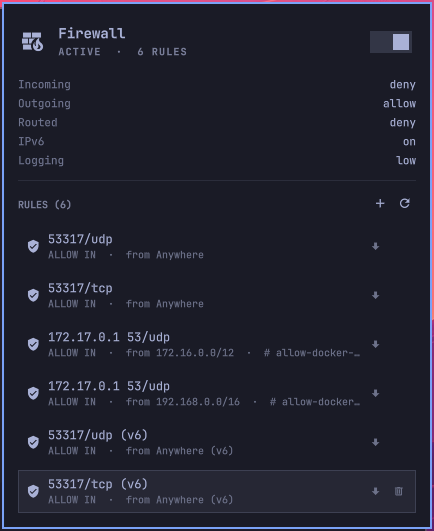
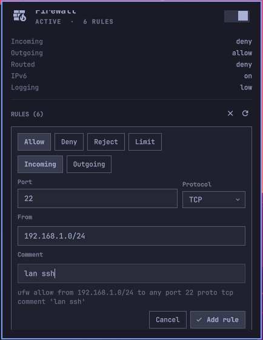
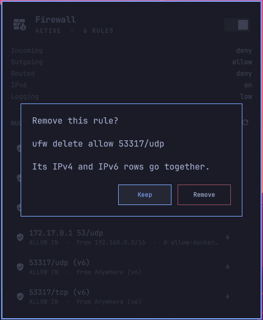

# Firewall

ufw status in the Omarchy bar.

A wall with flames while the firewall is up; the same wall with the fire out,
in the theme's urgent colour, while it is down. Click it for the default
policies, the rules currently in place, and the controls that change any of
it — the switch, a form that adds a rule, and a bin on each row that takes
one away.



## Installing

```bash
omarchy plugin add https://github.com/srozen/omarchy-ufw.git --enable
```

That clones it into `~/.config/omarchy/plugins/` and puts the icon in the right
section of the bar. Drop `--enable` to install it without turning it on, and
enable it later from Omarchy's widget settings or with:

```bash
omarchy plugin enable srozen.ufw right
```

ufw itself is a separate package — `sudo pacman -S ufw` if it is not already
there. The widget will sit in the bar dimmed and say so until it is.

Updating and removing go through the same command:

```bash
omarchy plugin update srozen.ufw
omarchy plugin remove srozen.ufw
```

## What it shows

**In the bar** — one icon, three states:

| State | Icon | Colour |
|-------|------|--------|
| Active | wall with flames | bar foreground |
| Inactive | wall, no flames | bar urgent |
| Not installed, or not yet read | wall, no flames | dimmed |

Active, sitting among its neighbours at the right end of the bar:


Inactive — the flames are out and the wall has gone to the theme's urgent
colour, which is the point: it should be the thing your eye lands on:


Hovering gives the same thing in words: `active — 6 rules`, `inactive —
nothing is being filtered`, `ufw is not installed`.

**In the panel** — the switch, the default policies for incoming, outgoing and
routed traffic, whether IPv6 is on, the log level, and every rule ufw would
print, written the way `ufw status` writes it so the two can be checked against
each other. Click a rule to copy it, or use the two sections below to add one
and take one away.

## Adding a rule

The `+` beside the RULES heading opens a form, or press `a`. Pick what the rule
does and which direction it applies to, give it a port, a source, or both, and
the line under the form fills in with the command it is about to run:

```
ufw allow 22/tcp
ufw limit out 8000:8010/udp comment 'test rig'
ufw allow from 192.168.1.0/24 to any port 22 proto tcp
```



That line is the point of the form. The rest of the panel is careful to say
things the way ufw says them so the two can be checked against each other, and
a form that hid what it was about to run would be the one place that stopped.
It also means the form teaches the command rather than replacing it.

The fields:

| Field | Takes |
|-------|-------|
| Action | `allow`, `deny`, `reject`, `limit` |
| Direction | Incoming or outgoing |
| Port | `22`, a range `8000:8010`, or a list `80,443` — ranges and lists need TCP or UDP, because that is a multiport match and iptables will only do those two |
| Protocol | TCP, UDP, or Any. Any and a port is two rules to iptables, which is what `ufw allow 22` does too |
| From | Blank for Anywhere, or an address or CIDR block, v4 or v6. Not a hostname — a name that resolves differently tomorrow would silently be a different rule, and ufw stores what it is given |
| Comment | Anything but an apostrophe, which ufw's own parser refuses |

A rule with neither a port nor an address is refused: that is a rule about all
traffic, which is what the default policies above it are for.

Application profiles — `ufw allow CUPS` — are shown and can be removed, but the
form does not offer them. They come from `ufw app list`, which needs root, and a
password prompt to populate a dropdown is a worse trade than typing the port.

## Removing a rule

Put the cursor on a rule and a bin appears at its right edge; click it, or press
`x`. A dialog names the exact command first, and lands on Keep rather than
Remove, because that is the pause it exists to buy.



Rules are removed **by rule, not by number**. `ufw delete 3` means "whatever is
third right now", and between reading the rule files and the password dialog
coming back, third can be something else — a rule added from a terminal, or the
firewall reloaded. Naming the rule cannot go wrong that way: if it is no longer
there, ufw says so and nothing is removed.

Writing a stored rule back out as the command that made it is a port of ufw's
own `UFWCommandRule.get_command()`, in `Model.js`, with tests that check the
awkward cases against what ufw produces — the short and long forms, log types,
interface clauses, app profiles with spaces in the name, and `route` rules.

The comment is deliberately left off the delete. ufw removes a rule whose only
difference is the comment, but only when the delete carries none, so leaving it
out matches the rule with or without one.

A rule written without an address is one rule to ufw and two rows here, since
the v4 and v6 halves live in separate files. Removing either takes out both, and
the dialog says so when that is what is about to happen.

## Reading costs nothing; writing asks

`ufw status` needs root, but only because it shells out to iptables to confirm
the firewall is loaded. Everything it prints comes from files that a stock ufw
install leaves world-readable:

```
/etc/ufw/ufw.conf     ENABLED, LOGLEVEL
/etc/default/ufw      the three default policies, and IPV6
/etc/ufw/user.rules   the v4 rules, as `### tuple ###` lines
/etc/ufw/user6.rules  the v6 rules
```

So the widget reads those directly. No password to look, no polling a command
that would need one, and no widget-shaped hole in the bar while it waits. The
files are watched, so a rule added from a terminal appears in the panel without
the panel being touched; the timer behind it is a safety net for a write that
lands as a replace and slips past inotify.

Changing the firewall is a different matter, and stays one. The switch runs
`ufw --force enable` or `ufw disable` under `pkexec`, which puts Omarchy's own
authentication dialog in front of it — the same one every other privileged
action on the desktop uses. `--force` is there to skip ufw's "this may disrupt
existing ssh connections" prompt, which has no one to answer it here. Adding and
removing rules go through the same door.

The switch throws the moment it is clicked rather than a file-watch later. That
is an optimistic value, dropped as soon as `ufw.conf` agrees or after the
settle timer gives up, so a refused password leaves the switch where the
firewall actually is.

If your `/etc/ufw/user.rules` is not world-readable, the panel says so and
hides the rule list rather than claiming the firewall has none.

## What guards the commands

Two rules cover everything that ends up in front of `pkexec`.

**Arguments are a list, never a string.** Nothing in `Model.js` or
`UfwController.qml` builds a command line, so there is no shell to quote for and
nothing a space or a semicolon in a comment could break out of. The one
exception is the `terminal` elevation setting, which has to hand a terminal a
line of shell — and that path quotes every argument individually on the way out.
The command shown in the panel is display only; the list is what runs.

**Nothing reaches the list unvalidated.** Argument vectors already close the
injection hole, but ufw has flags of its own — it strips `--force`, `--dry-run`
and `-f` off the front of its arguments — so a field allowed to start with a
dash would be choosing ufw's behaviour rather than filling in a rule. Every
value is checked against a shape it must have, every field refuses a leading
dash and control characters regardless, and a build that fails hands back an
empty list rather than a half-built one. `run()` re-checks the whole list one
step from the password dialog and refuses to run rather than run something odd.

The same check applies to rules read off disk. Those come from a root-owned
file, so it is belt and braces — but a row the model cannot write back out
safely is a row this widget offers no bin for, because guessing at an argument
list is how the wrong rule gets deleted.

`ufw` itself, `pkexec`, `sudo` and `sh` are all named by absolute path and never
looked up in `PATH`, for the reasons in the header of `UfwController.qml`.

## Settings

Set from Omarchy's widget settings, or in this widget's entry in
`~/.config/omarchy/shell.json`.

| Key | Default | Meaning |
|-----|---------|---------|
| `elevation` | `pkexec` | `pkexec` uses Omarchy's authentication dialog. `terminal` opens a floating terminal running `sudo ufw …`, for a session with no polkit agent. |
| `refreshIntervalSec` | `30` | How often to re-read the state files regardless of the watchers. |

## Mouse and keyboard

| Input | Does |
|-------|------|
| Left click on the bar icon | Open or close the panel |
| Middle click on the bar icon | Re-read ufw's state |
| Click the hero, or `t` | Toggle the firewall |
| Click a rule, or `Enter` on one | Copy it |
| `j`/`k`, arrows | Move the cursor |
| `+`, or `a` | Open the add-rule form |
| The bin on a rule, or `x` | Remove it, after confirming |
| `r` | Re-read |
| `Esc` | Close the form, then the dialog, then the panel |

While the form or the confirmation is up it owns the keyboard outright: `Tab`
walks the fields, `h`/`l` walks the chips within a group, `Enter` in any field
adds the rule, and `Esc` backs out with what was typed discarded. The panel's
own cursor is parked rather than moved, so nothing is ever highlighted in two
places at once.

Nothing on the bar icon itself turns the firewall off. That is a decision, and
it belongs behind the switch in the panel where the current state is visible.

## IPC

```bash
omarchy-shell srozen.ufw status     # active | inactive | unknown | not installed
omarchy-shell srozen.ufw rules      # one rule per line, as `ufw status` writes them
omarchy-shell srozen.ufw enable
omarchy-shell srozen.ufw disable
omarchy-shell srozen.ufw refresh
omarchy-shell srozen.ufw toggle     # the panel, not the firewall
```

Deliberately no `add` or `delete`. Anything on the session bus can reach these
handlers, and a rule is a decision that should be made by someone looking at the
panel. `ufw` itself is the interface for scripts.

## Files

| File | Role |
|------|------|
| `manifest.json` | Plugin id, kind, entry point, settings schema |
| `Panel.qml` | Bar button and popup. Layout, cursor, keyboard, IPC surface |
| `UfwController.qml` | The state files, the optimistic state, and the two privileged commands |
| `Model.js` | Pure parsing and row-building. No QML, no side effects |
| `tests/run.js` | Everything `Model.js` assumes about ufw's on-disk format, and every rule it writes back out |

## Working on it

QML files under `~/.config/omarchy/plugins/` hot-reload on save — but only the
entry point named in the manifest. A change to `UfwController.qml` or
`Model.js` needs the shell restarted before it takes:

```bash
omarchy restart shell
```

The shell writes to `/dev/null` under a normal session, so QML errors are
invisible. The running instance keeps a log regardless:

```bash
quickshell list --all                       # find the instance id
quickshell log -i <id> -t 200
```

Checks, run from the plugin directory and its parent respectively:

```bash
node tests/run.js
omarchy plugin validate .
```

Only the first of those runs in CI, on every push and pull request
(`.github/workflows/tests.yml`). The others need Omarchy and Qt on the machine,
which a runner does not have, so they stay local.

qmllint resolves `qs.Commons` and `qs.Ui` if it is given an import root that
contains a directory called `qs`, which the shell's own layout does not provide.
One symlink is enough:

```bash
mkdir -p /tmp/qsimports && ln -sfn /usr/share/omarchy/shell /tmp/qsimports/qs
/usr/lib/qt6/bin/qmllint -I /tmp/qsimports Panel.qml UfwController.qml
```

With that it really type-checks: a misspelled property on a `Button` or a
`TextField` is caught. What is left is noise from the singletons — `Style.font`,
`Style.spacing` and `Color.popups` are inline `QtObject`s that qmllint cannot see
into, and `bar` is an untyped `QtObject`, so every use of them reports as a
missing member. The first-party widgets produce the same. Compare the counts
before and after a change rather than reading the list.

To load the widget without taking over the bar — enough to prove the QML
resolves, its bindings type-check and nothing throws — build it under a
stand-in bar and never show it:

```bash
cat > /tmp/harness.qml <<'EOF'
import QtQuick
import Quickshell
ShellRoot {
  QtObject {
    id: fakeBar
    property color foreground: "#cacccc"
    property color urgent: "#a55555"
    property color barForeground: "#cacccc"
    property string fontFamily: "monospace"
    property string position: "top"
    function run(cmd) { console.log("bar.run:", cmd) }
    function switchPanelFrom(o, d) { return false }
  }
  Component.onCompleted: {
    var c = Qt.createComponent("Panel.qml")
    if (c.status === Component.Error) { console.log(c.errorString()); Qt.quit(); return }
    var it = c.createObject(null, { bar: fakeBar, settings: {} })
    console.log(it ? "loaded" : c.errorString())
    Qt.quit()
  }
}
EOF
cp /tmp/harness.qml ./harness.qml    # must sit beside Panel.qml to find UfwController
QML_IMPORT_PATH=/tmp/qsimports qs -p ./harness.qml
rm harness.qml
```

`KeyboardPanel` maps no surface while `open` is false, so nothing appears on
screen. Setting `settings: { elevation: "terminal" }` and giving the stand-in
bar a `run()` that only prints is how the shell-quoting on that path gets
checked without running `ufw` at all.

## Why the glyphs are codepoints

`String.fromCodePoint(0xF1A11)` rather than the character itself, because
editing tools routinely mangle multi-byte sequences in QML and JavaScript.
The two that matter are `md-wall_fire` (U+F1A11) and `md-wall` (U+F07FE).

## License

MIT. See [LICENSE](LICENSE).
